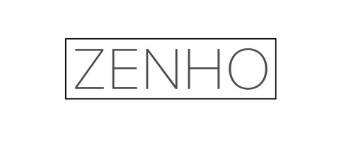
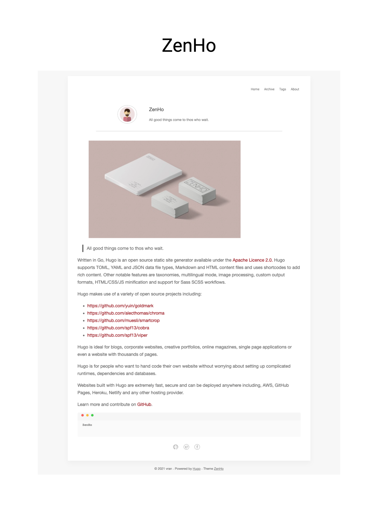

<p align="center">
    
</p>

## Languange

English | [中文](README_ZH.md)


## What

**ZenHo** is a pretty simple & nice theme for [Hugo](https://gohugo.io/)

> All good things come to thos who wait.


### Features TODO

- [ ] Disqus comment
- [ ] Google Analytics
- [x] Baidu Analytics
- [x] Table of Content
- [x] Social  list
- [x] Utteranc comment


## How to use

Step 1 : 

​	If you know  [Hugo](https://gohugo.io/) for the first time,you need to learn  [official tutorial](https://gohugo.io/getting-started/quick-start/) first.

Step 2 : 

​	you can use  `hugo-zenHo/archetypes/default.md`  replace your blog's `archetypes/default.md` `

Step 3 :  

​	If you want to custon your **about page**, you should create markdown file `content/about/_index.md`, then write it in markdown syntax.

Step 4:

​	Copy [Configuration Override](##Configuration Override) content to your config.toml，for better highlight, you can use `xcode` style

```toml	
[markup]
  [markup.highlight]
    style = "xcode"
```


More info could be found at **exampleSite** directory.


## Configuration Override

You can copy some item to your `config.toml` .

```toml
baseURL = "http://localhost:1313/"
languageCode = "en-us"
title = "ZenHo"
paginate = 6

[params]
    enableSummary = true
    useDescriptionReplaceSummary = true
    enableToc = false

    author  = "vran"
    bio = "All good things come to thos who wait."

    # baidu analytics
    enableBaiduAnalytics = false
    baiduAnalyticsToken = ""

    # social page url
    github = "#"
    twitter = "#"
    facebook = "#"
    email = ""

    # utteranc comment
    enableUtteranc = false
    [params.utteranc]
        repo="username/github-page-repository"
        theme="github-light"
        crossorigin="anonymous"
        issueTerm="pathname"
        label="Comment"

[markup]
  [markup.highlight]
    style = "xcode"
  [markup.tableOfContents]
    endLevel = 2
    ordered = false
    startLevel = 2
```


## Screenshots

- Home

  


- post

  

  

  


- Archive

  

- tags

  


- About

  
