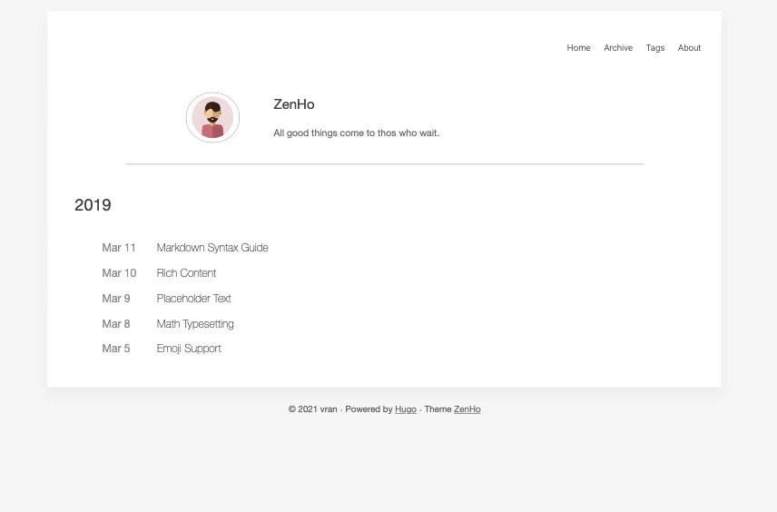

## Languange

English | [中文 TODO](#)


## What

**zenHo** is a pretty simple & nice theme for [Hugo](https://gohugo.io/)

> All good things come to thos who wait.


### Features TODO

- [ ] Disqus support
- [ ] Google Analytics  / Baidu Analytics supp ort
- [ ] Table of Content
- [ ] Social card list
- [x] support  utteranc 


## How to use

Step 1 : If you know  [Hugo](https://gohugo.io/) for the first time,you need to learn  [official tutorial](https://gohugo.io/getting-started/quick-start/) first.

Step 2 (option) : you can use  `hugo-zenHo/archetypes/default.md`  replace your blog's `archetypes/default.md` `


## Configuration Override

You can copy some item to your `config.toml` .

```toml
baseURL = "http://localhost:1313/"
languageCode = "en-us"
title = "ZenHo"
paginate = 6

[params]
    enableSummary = true
    useDescriptionReplaceSummary = true
    author  = "vran"
    bio = "Your bio。"
    
		enableUtteranc = true
    [params.utteranc]
        repo="username/github-page-repository"
        theme="github-light"
        crossorigin="anonymous"
        issueTerm="pathname"
        label="Comment"
```


## Screenshots

- Home

  


- content

  

  

  


- Archive

  

- tags

  


- About

  