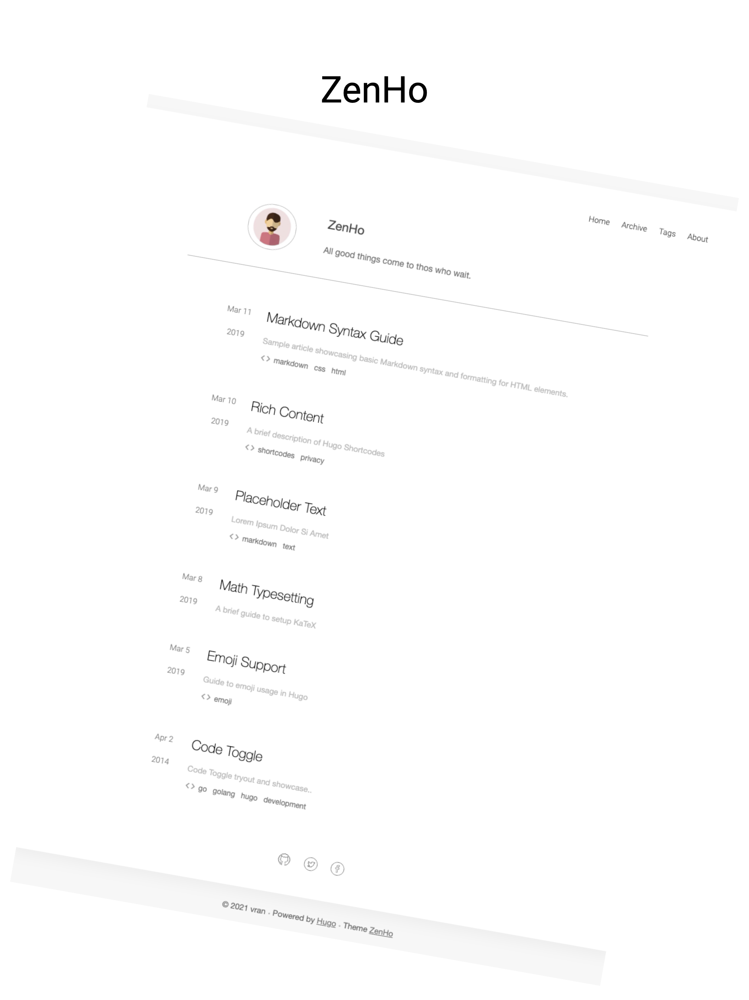

<p align="center">
    
</p>

## Languange

[English](README.md) | 中文


## What

**ZenHo** 是一个极简风格的  [Hugo](https://gohugo.io/) 主题

> All good things come to thos who wait.


### Features

- [ ] Disqus 评论插件
- [ ] Google / Baidu 分析支持
- [x] 文章目录
- [x] utteranc  评论插件


## How to use

步骤一：

​	如果你是第一次了解到 [Hugo](https://gohugo.io/) 的话，你需要先看一下官方的[入门教程](https://gohugo.io/getting-started/quick-start/)

步骤二：

​	你可能需要用 `hugo-zenHo/archetypes/default.md` 替换 Hugo 默认的 `archetypes/default.md` 文件

步骤三：

​	如果你要自定义 about 页面，需要创建  `content/about/_index.md` 文件， 然后以 markdown 格式书写内容即可 

步骤四：

​	复制 [Configuration Override](##Configuration Override) 下的内容到你的 config.toml，为了更好的代码高亮展示，建议设置主题为 xcode

```toml	
[markup]
  [markup.highlight]
    style = "xcode"
```


具体的实例可以参考 **exampleSite** 目录


## Configuration Override

You can copy some item to your `config.toml` .

```toml
baseURL = "http://localhost:1313/"
languageCode = "en-us"
title = "ZenHo"
paginate = 6

[params]
    enableSummary = true
    useDescriptionReplaceSummary = true
    author  = "vran"
    bio = "Your bio。"
    enableUtteranc = true
    # social page url
    github = "#"
    twitter = "#"
    facebook = "#"
    email = ""
    [params.utteranc]
        repo="username/github-page-repository"
        theme="github-light"
        crossorigin="anonymous"
        issueTerm="pathname"
        label="Comment"

[markup]
  [markup.highlight]
    style = "xcode"
  [markup.tableOfContents]
    endLevel = 2
    ordered = false
    startLevel = 2
```


## Screenshots

- Home

  


- post

  

  

  


- Archive

  

- tags

  


- About

  

